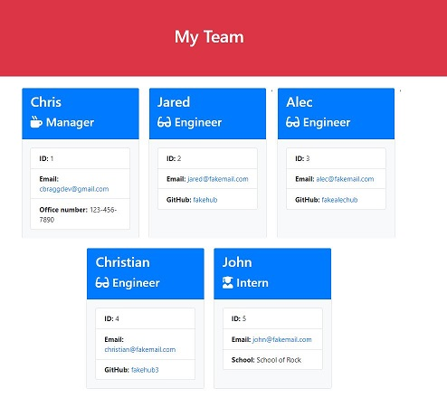
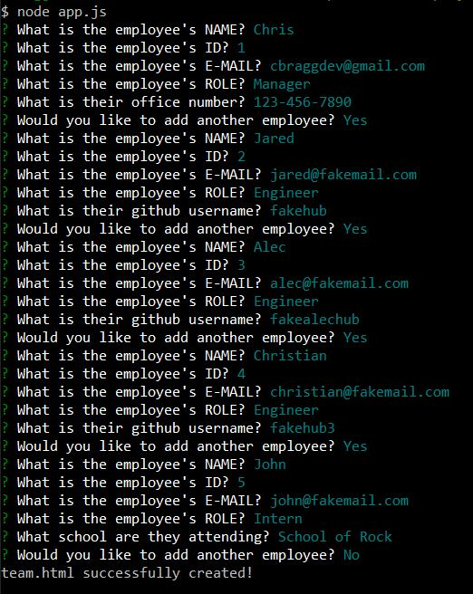

# Employee-Template-Engine (Node.JS)

## Description
Command line application for creating an employee summary using **JavaScript Classes/Subclasses**,   
**Node.js**, **Inquirer**, and **Jest** Test Driven Development. The CLI will prompt the user and  
render the response to templated HTML. See attached video example: https://youtu.be/fHQHjNKb_z8.      

*Initialize the application with the code below, with prompts for user input for each section.

```sh
node app.js
```
## Prompts/Output:  
* Employee Name  
* Employee ID  
* Employee E-mail    
* Employee Role   
  * Manager: Office Number  
  * Engineer: GitHub Username  
  * Intern: School  

## User Story:  

AS A MANAGER  
I want to generate a webpage that displays my team's basic info  
SO that I have quick access to emails and GitHub profiles

## Example Webpage:  


## CLI Interface:  


## Latest Commit  
-Replaced mp4 with link to youtube demo  

## Previous Commits  
-Updated README.md  
-Added screenshots and video demo  
-Added inquirer validate functions to check name is non-empty string and ID is non-empty integer  
-Added CSS to templates to style employee cards  
-Added Inquirer Prompts  
-Created function to handle response  
-Created new employee instance conditional on response  
-Rendered the output and wrote to team.html file  
-Installed package dependencies  
-Completed classes in "/lib" and Jest testing passed  
-Created output folder  